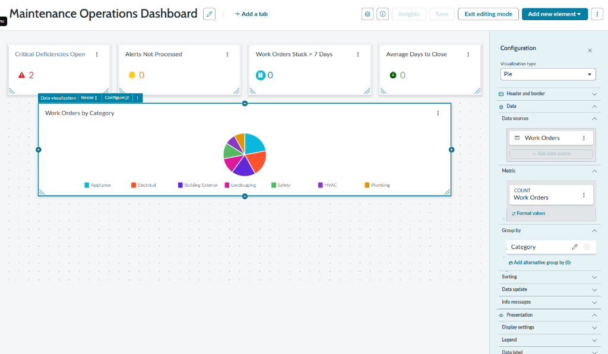
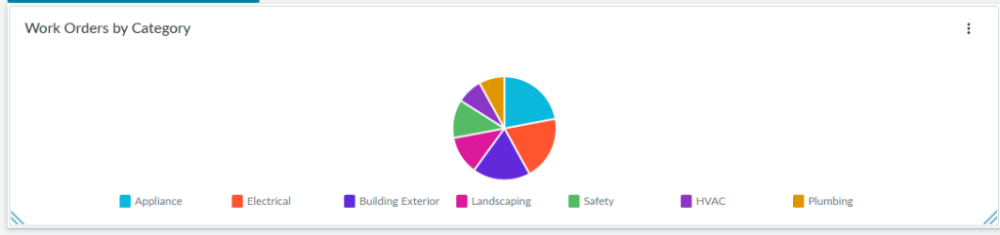
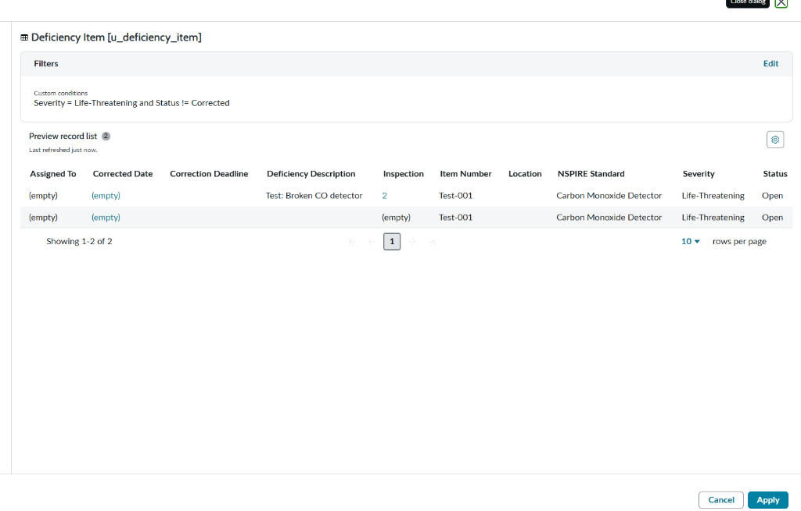
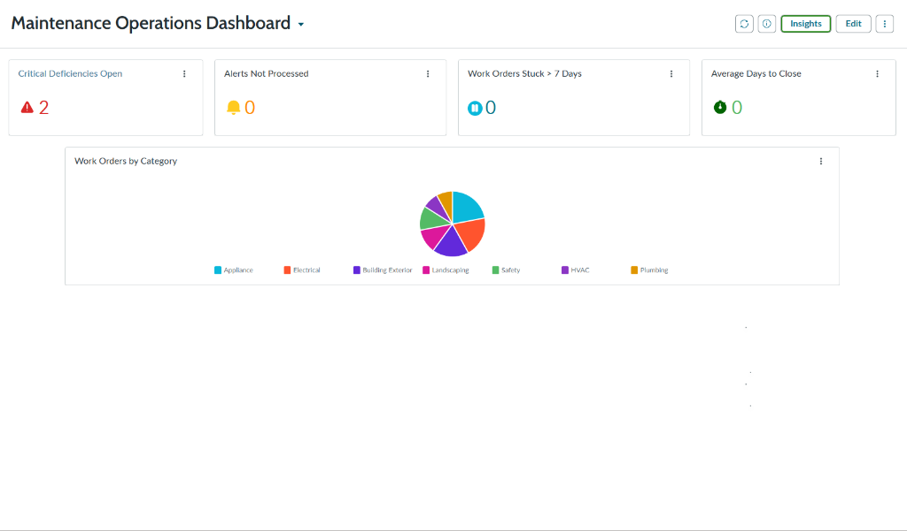

# Maintenance Operations Dashboard

Designed and delivered an analytics dashboard to provide real-time visibility into maintenance operations, compliance status, and process efficiency. Built using Platform Analytics with custom data sources to consolidate operational metrics into a single-screen view for decision-making.

**Business Value:** Provides centralized operational visibility, identifies process bottlenecks, tracks compliance risk, and enables data-driven resource allocation.

---

## Business Problem

**Before:**
- No centralized view of maintenance operations performance
- Compliance risks hidden until annual inspections
- Process bottlenecks discovered reactively (stuck work orders)
- Manual report compilation from multiple systems
- No visibility into workload distribution across maintenance categories

---

## Solution Delivered

**Operations Analytics Dashboard:**
- Created custom work orders table (`u_work_orders`) with 50 test records
- Built 5 analytics widgets using Platform Analytics:
  1. **Critical Deficiencies Open:** COUNT of life-threatening items
  2. **Alerts Not Processed:** COUNT of unprocessed maintenance alerts
  3. **Work Orders Stuck >7 Days:** COUNT of stalled processes
  4. **Average Days to Close:** AVERAGE work order cycle time
  5. **Work Orders by Category:** Pie chart distribution (7 categories)
- Configured data sources with multi-condition filtering
- Implemented date-based calculations (relative dates, duration metrics)
- Designed color-coded widgets for visual priority indicators

---

## Business Value

**What the System Does:**
- **Provides centralized visibility** into maintenance operations from single dashboard
- **Identifies process bottlenecks** through stuck work order tracking
- **Tracks compliance risk** via critical deficiency monitoring
- **Enables resource planning** through workload distribution analysis
- **Supports data-driven decisions** with real-time operational metrics

---

## Technical Highlights

**ServiceNow Features Used:**
- **Platform Analytics:** Data aggregation and visualization
- **Homepage Dashboards:** In-line editor for widget configuration
- **Data Visualization:** Single-score metrics, pie charts
- **Filtering Logic:** Multi-condition filters (severity, status, date ranges)
- **Date Calculations:** Relative date filtering (last 30 days, >7 days ago)
- **Aggregation Functions:** COUNT, AVERAGE

**Widget Configuration Examples:**

**Critical Deficiencies:**
- Metric: COUNT
- Filter: Severity = Life-Threatening AND Status ≠ Closed
- Purpose: Regulatory compliance risk indicator

**Average Days to Close:**
- Metric: AVERAGE (closed_date - opened_date)
- Filter: State = Closed, Last 30 days
- Purpose: Process efficiency tracking

**Work Order Distribution:**
- Type: Pie Chart
- Group By: Category (HVAC, Plumbing, Electrical, Appliance, etc.)
- Purpose: Resource allocation visibility

---

## Screenshots

### Dashboard Full View
  
*Complete dashboard showing 5 operational metrics including deficiency tracking, alert processing, and workload distribution*

### Work Orders by Category
  
*Workload distribution across 7 maintenance categories for resource planning*

### Filter Configuration
  
*Multi-condition filtering logic for compliance tracking metrics*

### Executive View
  
*Clean presentation view optimized for stakeholder reporting*

---

## Setup Notes

**Environment:** ServiceNow Personal Developer Instance (Zurich Release)

**Prerequisites:**
- Platform Analytics enabled
- Custom work orders table created
- Deficiency and alert tables (from related projects)

**Key Tables:**
- `u_work_orders` (custom table, 50 test records)
- `u_deficiency_item` (from Compliance Application)
- `u_maintenance_alert` (from Alert Processing System)

**Data Generation:**
Background script created realistic test data:
- 50 work orders with varied dates and statuses
- Distribution across 90-day period for trend analysis
- Mix of open/closed for efficiency calculations

---

## Technologies

- ServiceNow Platform Analytics
- Homepage Dashboards
- Data Visualization Widgets
- JavaScript (background scripts for test data)
- Platform Analytics Data Sources

---

## Related Projects

Consolidates data from [Compliance Application](../project1_asset_compliance) (deficiencies), [Alert Processing System](../project3_api_integration) (alerts), and custom work orders table.

---

**Built on ServiceNow Platform Analytics (Zurich Release)**
